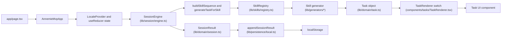
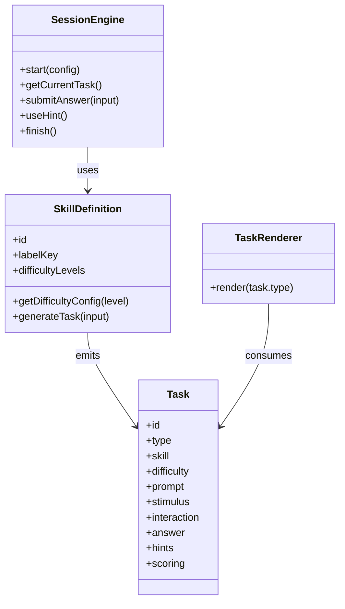
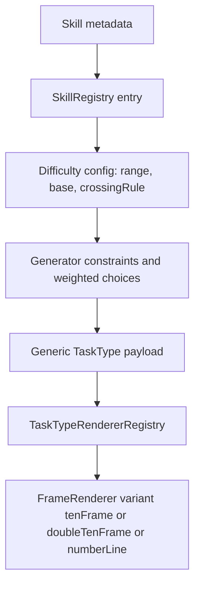

# Extensible Architecture Baseline

## Goal

Define the "always reliable" architecture contracts for MVP 1:

- Adding a skill should not require changing `SessionEngine`.
- Adding a task renderer should not require changing generator logic.
- Difficulty and anti-repeat behavior should stay centralized.
- Persistence should remain behind one replaceable boundary.

This is based on current code plus the constraints in `ENABLEMENT.md`, `ROADMAP_v1.md`, and `ROADMAP_v2.md`.

## As-Built Runtime Flow (Current)

## Stable Contracts To Keep

## Current Extension Seams

1. Skill extension seam: `lib/skills/registry.ts`
2. Generator seam: `lib/generators/*` and `generateTaskForSkill`
3. Renderer seam: `components/tasks/TaskRenderer.tsx`
4. Persistence seam: `lib/persistence/local.ts`

## Desired Hardening (From Enablement and Roadmap)

## Architecture Invariants

1. `SessionEngine` must stay task-type agnostic.
2. Skill-specific rules stay in skill definitions and generators.
3. Renderers consume typed task payloads and avoid business-rule branching.
4. Anti-repeat and adaptive difficulty stay centralized in engine/generator utilities.
5. All persisted progress writes flow through one storage module interface.

## Gap Notes (Current vs Target)

1. `TaskRenderer` is currently switch-based, not registry-based.
2. Skill definitions currently map one skill to one generator; roadmap expects per-skill task-type mix.
3. Difficulty config currently focuses on speed thresholds; enablement expects richer config (`base`, `range`, `crossingRule`).
4. Persistence is local-only and function-based; long-term plan expects a `ProgressStore` interface.
