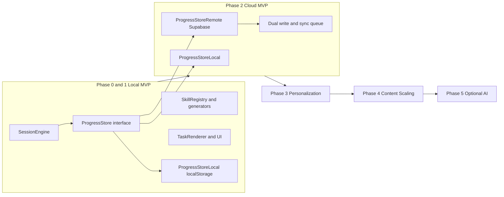
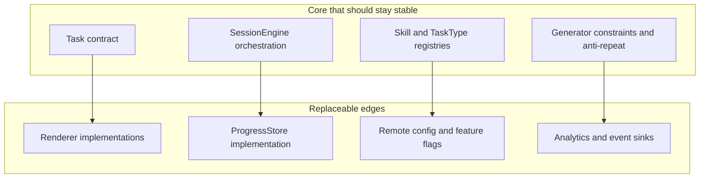
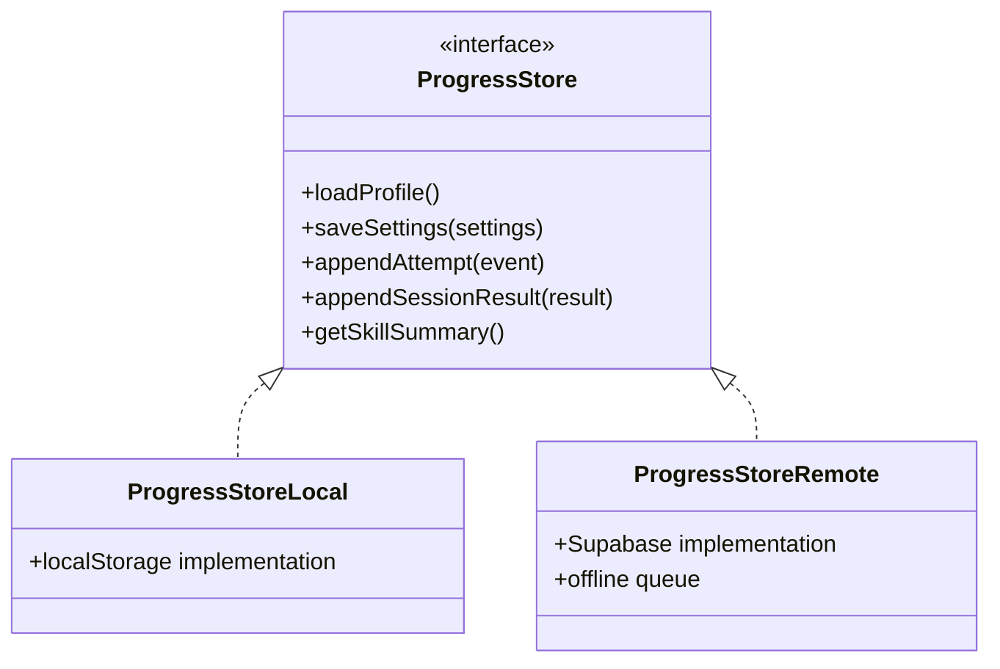
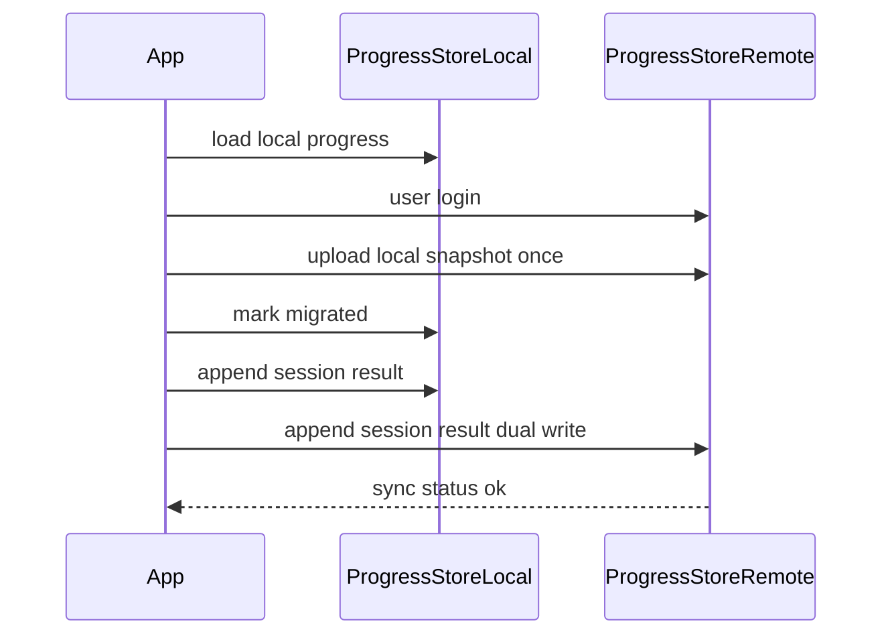

# Big Picture Architecture Evolution

## Goal

Show how the current local-first MVP evolves without breaking the extensible core contracts.

This doc aligns `LONG_TERM.md` with current implementation boundaries.

## Phase View

## Reliable Core vs Replaceable Edges

## Recommended ProgressStore Abstraction

## Migration Path (No Pain Transition)

## Extending to New Math Domains (Bridge 10 to Bridge 20)

From `ENABLEMENT.md`, treat new content as configuration and generators, not engine rewrites:

1. Add skill metadata (`concept`, `base`, `operation`, optional `mode`).
2. Add or reuse generic task types (`fillToBase`, `bridgeSubtract`, etc).
3. Add representation variant (`tenFrame`, `doubleTenFrame`, `numberLine`) via renderer registry.
4. Keep the session and persistence contracts unchanged.

## Guardrails For Future Work

1. New skill PRs should only touch registry, generators, i18n text, and renderer mapping.
2. New storage backends should implement `ProgressStore` and avoid app-level branching.
3. New personalization logic should consume attempt/session events, not mutate task contracts.
4. AI or remote planning must emit valid task blueprints that pass deterministic generator validation.
